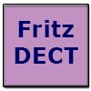

# ioBroker.fritzdect

[](https://www.npmjs.com/package/iobroker.fritzdect)
[](https://www.npmjs.com/package/iobroker.fritzdect)
[](https://travis-ci.org/foxthefox/ioBroker.fritzdect)

[](https://nodei.co/npm/iobroker.fritzdect/)

Fritzbox DECT adapter for ioBroker

## Installation:
released version on npm with
```javascript
 npm install iobroker.fritzdect
```


or the actual version from github with 
```javascript
npm install https://github.com/foxthefox/ioBroker.fritzdect/tarball/master --production
```
## Setup

IP-address and password of Fritzbox should be defined in io-package.json or via admin page, before the first start of the instance.

The devices are detected automatically during startup of fritzdect instance.

the widget requires that also vis-metro and vis-jqui-mfd are installed

## objects

|Object|Value|settable|Description|
|--------|-------|:-:|--------|
|DECT200.state|boolean|x|true/false -> ON/OFF|
|DECT200.mode|boolean|-|not live, for future version|
|DECT200.lock|boolean|-|not live, for future version|
|DECT200.present|boolean|-|true/false -> connected/not available|
|DECT200.temp|value|-|actual temperature in °C|
|DECT200.power|value|-|actual power in W|
|DECT200.energy|value|-|actual energy consumption in Wh|
|DECT200.name|text|-|name of device|
|COMET.temp|value|-|actual temperature in °C|
|COMET.targettemp|value|x|target temperature in °C|
|COMET.comfytemp|value|-|comfort temperature in °C|
|COMET.nighttemp|value|-|night temperature in °C|
|COMET.battery|value|-|actual capacity in %|
|COMET.mode|array|-| AUTO/OFF/ON state of thermostat|
|COMET.lasttarget|value|-| last target temperature in °C|
|GuestWLAN.state|boolean|x|true/false -> ON/OFF|


## Known Issues:
Sometimes the setting of a command for switch or targetTemp does not work. Seems a combination of certain FW and fritzBox model.

## TODO:
* DECT100 temperature reading

## Changelog
### 0.0.11
* added mode AUTO/OFF/ON for thermostat (including datapoint lasttarget when going back to AUTO)

### 0.0.10
* change to object oriented interface
* getOSversion when starting for log

### 0.0.9
* values '1' accepted for ON
* values '0' accepted for OFF

### 0.0.8
* messages info-> debug
* values 1/true/on/ON accepted for ON
* values 0/false/off/OFF accepted for OFF

### 0.0.7
* current temp of Comet/DECT300
* cyclic polling GuestWLAN

### 0.0.6
* correction targettemp in DECT200 section

### 0.0.5
* setTemp on COMET
* GuestWlan corrected

### 0.0.4
* cyclic status polling

### 0.0.3
* user now configurable

### 0.0.2
* metro widget for Dect200
* smartfritz-promise->fritzapi
* running version, tested with 1x DECT200 and Fritzbox FW=6.51 on Win10 with 4.5.0 and raspberry 4.7.0

### 0.0.1
* running version, tested with 1x DECT200 and Fritzbox FW=6.30
